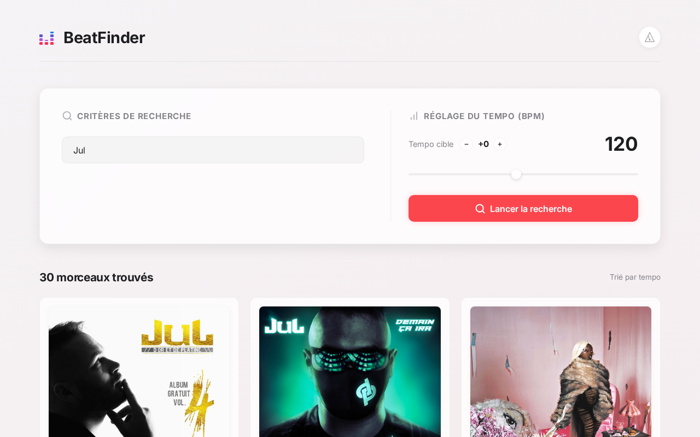

# BeatFinder - Recherche de Musique par BPM

BeatFinder est une application permettant de rechercher et de lire des morceaux sur Deezer, GetSongBPM et YouTube Music en fonction de leur tempo (BPM - Beats Per Minute).



L'application prend en charge la recherche d'un BPM exact avec la possibilité d'ajouter une marge supérieure de +0 à +5 BPM (ex: de 120 à 125 BPM).

## Architecture du Projet

Le projet est divisé en deux modules principaux :

- **`backend`** : Un serveur API Node.js/Express en TypeScript qui gère les requêtes vers l'API Deezer pour les recherches par mots-clés, l'API GetSongBPM pour les recherches par tempo, et résout les correspondances sur YouTube Music pour la lecture.
- **`frontend`** : Un tableau de bord web moderne développé avec React, TypeScript et Vite, conçu avec une interface claire premium et un lecteur audio YouTube Music intégré.

---

## Configuration et Lancement du Backend

Le backend nécessite une clé API GetSongBPM pour effectuer des recherches par tempo (la recherche par mot-clé fonctionne sans configuration).

### 1. Obtenir une clé API GetSongBPM

1. Créez un compte sur le site [GetSongBPM Register](https://getsongbpm.com/register).
2. Rendez-vous sur la page [GetSongBPM API](https://getsongbpm.com/api).
3. Cliquez sur "Request API Key" et renseignez les informations demandées (par exemple en utilisant votre profil GitHub public).
4. Récupérez votre clé API.

### 2. Configurer les variables d'environnement

Dans le dossier `backend` :

1. Copiez le fichier `.env.example` et renommez-le en `.env`.
2. Ouvrez `.env` et ajoutez votre clé API :

```env
PORT=5000
GETSONGBPM_API_KEY=votre_cle_api_getsongbpm
```

### 3. Installer les dépendances et démarrer le serveur

Depuis le dossier du backend :

```bash
pnpm install
pnpm start
```

Le serveur démarrera sur le port `5000` (`http://localhost:5000`).

---

## Configuration et Lancement du Frontend Web

Le frontend sert de tableau de bord de test dynamique et gère l'analyse de tempo en direct pour les recherches libres.

### 1. Installer les dépendances et démarrer l'application

Depuis le dossier du frontend :

```bash
pnpm install
pnpm dev
```

L'application web démarrera sur `http://localhost:5173`. Ouvrez cette adresse dans votre navigateur pour tester l'application !

---

## Configuration et Lancement de l'Application Mobile

L'application Expo reprend la recherche par BPM, la recherche textuelle, la pagination, les liens Deezer/YouTube, le thème sombre et un métronome visuel avec impulsion tactile sur Android.

### 1. Configurer l'adresse du backend

Dans le dossier `mobile`, créez un fichier `.env.local` à partir de `.env.example` :

```env
EXPO_PUBLIC_API_URL=http://192.168.1.20:5000
```

- **Téléphone physique** : utilisez l'adresse IP locale de l'ordinateur. Le téléphone et l'ordinateur doivent être sur le même réseau Wi-Fi.
- **Émulateur Android** : utilisez `http://10.0.2.2:5000`.
- **Simulateur iOS** : utilisez `http://localhost:5000`.

### 2. Lancer Expo

```bash
cd mobile
pnpm install
pnpm start
```

Scannez ensuite le QR code avec Expo Go, ou utilisez `pnpm android` / `pnpm ios` avec un émulateur installé.

> La recherche textuelle mobile affiche les morceaux Deezer sans calcul local du BPM. La recherche sans texte utilise les BPM fournis par GetSongBPM.

---

## Lancement avec Docker Compose

L'application peut être entièrement lancée avec Docker et Docker Compose. Dans cette configuration, le frontend est construit pour la production et servi par un serveur Nginx qui fait également office de reverse proxy pour rediriger les requêtes `/api/*` vers le conteneur backend.

### Prérequis

- Docker et Docker Compose installés sur votre machine.
- Le fichier `.env` configuré dans le dossier `backend`.

### Instructions de lancement

1. Démarrez les conteneurs :

   ```bash
   docker compose up --build -d
   ```

2. Ouvrez votre navigateur et accédez à l'application sur `http://localhost:8080`.
3. Pour arrêter les services :

   ```bash
   docker compose down
   ```

---

## Sécurité et Limitation de Débit (Rate Limiting)

Pour protéger le backend et les APIs tierces, chaque famille de routes possède son propre quota. Les valeurs se configurent dans `backend/.env` :

| Variable | Valeur par défaut | Rôle |
| --- | ---: | --- |
| `API_RATE_LIMIT_WINDOW_MS` | `900000` | Fenêtre du limiteur global, soit 15 minutes |
| `API_RATE_LIMIT_MAX` | `100000` | Filet de sécurité global sur `/api/*` |
| `PROVIDER_RATE_LIMIT_WINDOW_MS` | `60000` | Fenêtre commune aux APIs externes, soit 1 minute |
| `DEEZER_SEARCH_RATE_LIMIT_MAX` | `2000` | Recherches textuelles Deezer |
| `BPM_SEARCH_RATE_LIMIT_MAX` | `30` | Recherches GetSongBPM |
| `AUDIO_PROXY_RATE_LIMIT_MAX` | `2000` | Téléchargements d'extraits Deezer pour l'analyse BPM |
| `YOUTUBE_SEARCH_RATE_LIMIT_MAX` | `300` | Recherches YouTube |

Ces valeurs sont volontairement larges pour le développement local. Avant une exposition publique, réduisez-les selon les quotas réels de vos fournisseurs. Si `AUDIO_PROXY_RATE_LIMIT_MAX` est absent, le serveur choisit automatiquement la valeur la plus élevée entre `2000` et `CHUNK_SIZE × 10`.

---

## Fonctionnalités Clés de l'application

- **Recherche par tempo exact avec marge** : Saisissez un tempo cible et choisissez une marge supérieure (+0 à +5 BPM) pour obtenir les morceaux correspondants depuis la base de données de GetSongBPM.
- **Recherche Libre et Analyse en Direct** : Recherchez n'importe quel morceau par mot-clé (via Deezer) et laissez le navigateur analyser son extrait audio de 30 secondes en direct grâce à l'API Web Audio pour en calculer le BPM.
- **Chargement Progressif des Métadonnées** : Les morceaux trouvés par BPM récupèrent automatiquement et progressivement leurs pochettes d'album et liens d'écoute en arrière-plan depuis Deezer.
- **Lecteur YouTube Music Intégré** : Cliquez sur "Play YT" sur n'importe quel morceau pour charger et écouter le titre via un lecteur YouTube directement intégré en bas à droite de l'application.
